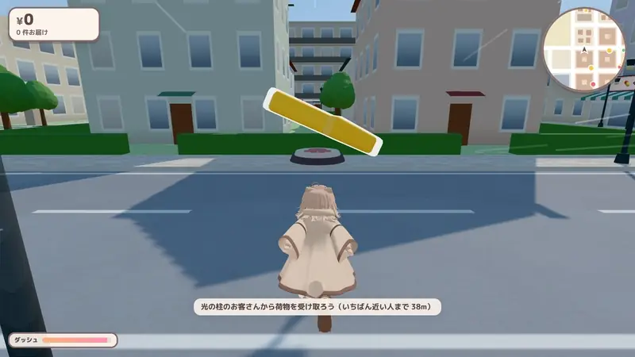
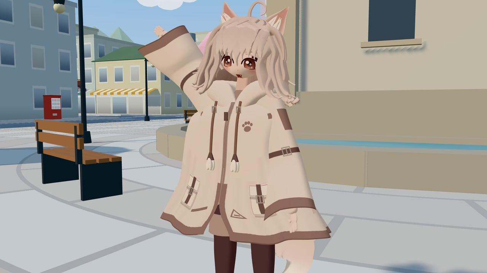
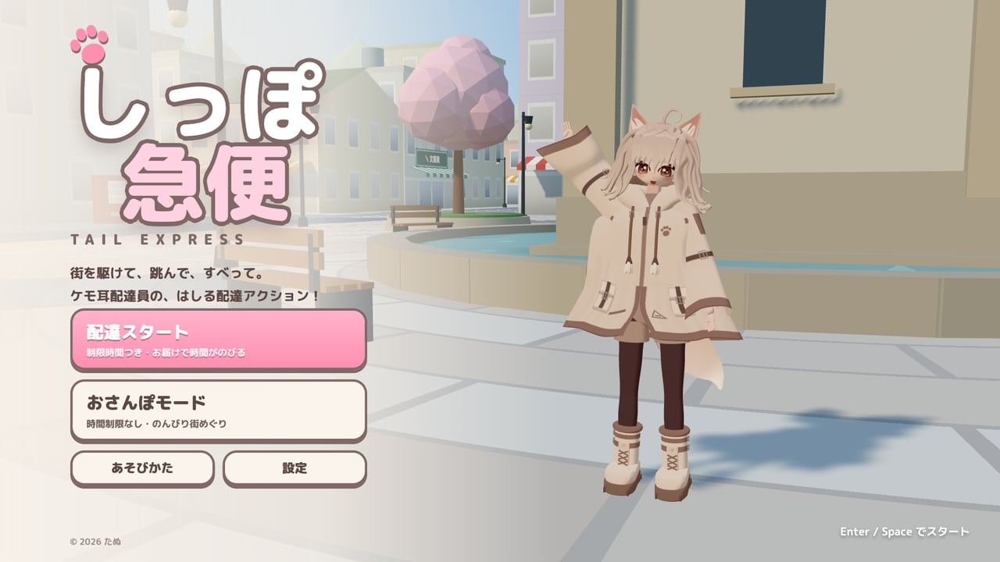
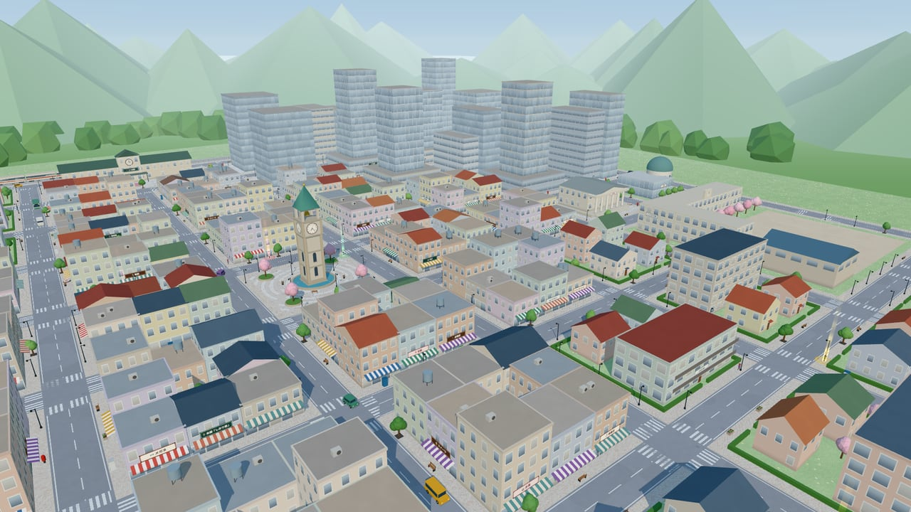
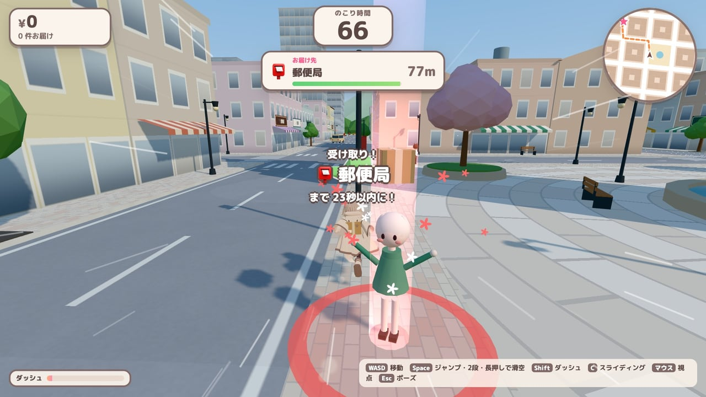
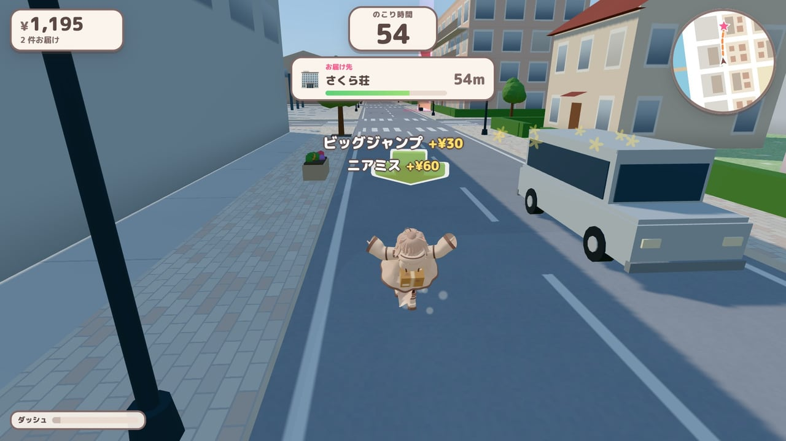
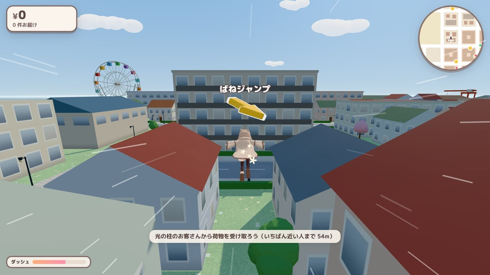
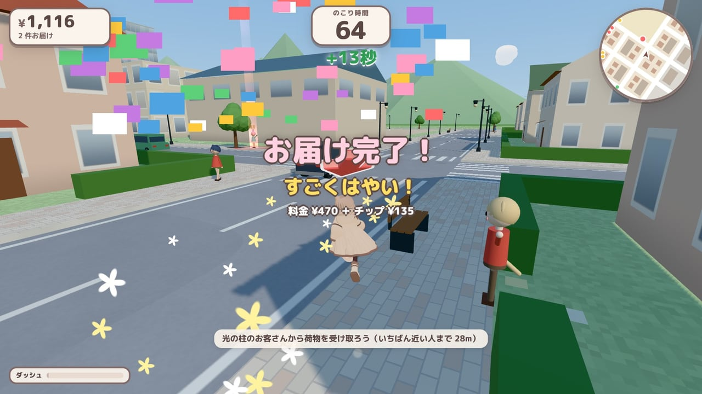
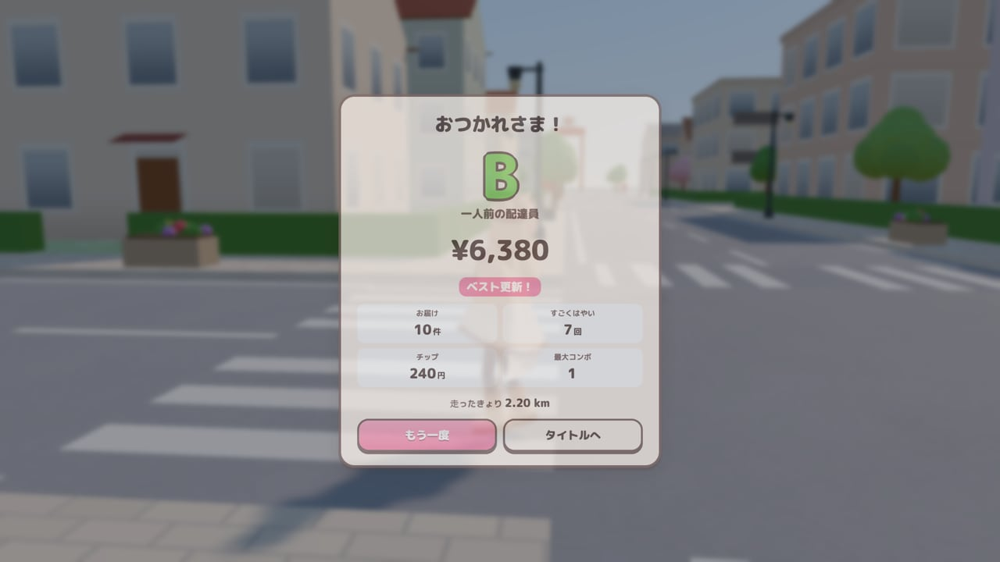

# しっぽ急便 — TAIL EXPRESS

ケモ耳の配達員になって、街を走って・跳んで・すべって荷物を届ける、ブラウザで遊べる 3D 配達アクション。

[](https://tanuu5.github.io/shippo-express/)
[](https://www.anthropic.com/claude)
[](./LICENSE)

<p align="center">
  
</p>

<p align="center"><b><a href="https://tanuu5.github.io/shippo-express/">▶ ブラウザで今すぐ遊ぶ</a></b>（インストール不要・PC 向け。スマホ用のタッチ操作もあります）</p>

**Claude Code × Claude Opus 5.5（MAX）** で作りました。

道ばたで待つお客さんから荷物を受け取り、制限時間のうちに届け先まで走って届ける、『クレイジータクシー』風の配達ゲームです。ただし車には乗らず、自分の足で走ります。
ダッシュ、2 段ジャンプ、ポンチョでの滑空、カベキック、ジャンプ台や車の屋根を使って、屋根から屋根へ近道しながら街を駆け抜けます。

主人公のケモ耳の配達員は、**キャラクターの画像 1 枚から**作りました。顔・髪・ポンチョ・ブーツ・しっぽまで、Three.js のコードで組み立てた 3D モデルです。
街並み・人・車・BGM・効果音もすべてコードで生成していて、ゲームの中では画像・3D モデル・音声のファイルを 1 つも使っていません。

## スクリーンショット

<table>
  <tr>
    <td width="50%"><br><sub>主人公は、ケモ耳としっぽの配達員。走るとポンチョのすそ・髪・しっぽ・ひも飾りが揺れ、表情も変わります。</sub></td>
    <td width="50%"><br><sub>タイトル画面。「配達スタート」は制限時間つき、「おさんぽモード」は時間を気にせず街をめぐれます。</sub></td>
  </tr>
  <tr>
    <td><br><sub>時計塔の広場を中心に、商店街・オフィス街・住宅街・港が広がる街。建物の配置もコードで生成しています。</sub></td>
    <td><br><sub>光の柱の下で手をふるお客さんに近づくと、荷物を受け取り。届け先と制限時間が出ます。</sub></td>
  </tr>
  <tr>
    <td><br><sub>車をすれすれでかわすと「ニアミス」、大きく跳ぶと「ビッグジャンプ」。技を決めるたびにチップが入ります。</sub></td>
    <td><br><sub>肉球マークのジャンプ台で高く跳んで、ポンチョで屋根の上を滑空。奥には港の観覧車。</sub></td>
  </tr>
  <tr>
    <td><br><sub>届け先の光の柱に飛びこんで「お届け完了！」。早く届けるほど料金が上がり、残り時間ものびます。</sub></td>
    <td><br><sub>時間切れでリザルト。売り上げで S〜D のランクがつきます（ベスト記録はブラウザに保存）。</sub></td>
  </tr>
</table>

画像と動画は、すべて実際のゲーム画面です。

## 遊び方

1. **お客さんを見つける**：光の柱の下で手をふっている人が依頼人です。柱の色は届け先までの距離（赤＝近い・黄＝ふつう・緑＝遠い）。
2. **荷物を届ける**：頭の上の矢印とミニマップの道順を見て、ピンクの光の柱まで走ります。早く届けるほど料金アップ。時間内に届かないと、荷物は営業所に戻ります。
3. **時間をのばす**：「配達スタート」は残り時間が 0 になったら終わりです。お届けするたびに時間がふえます。
4. **チップをかせぐ**：荷物を持っている間のジャンプ・滑空・車ジャンプ・ニアミスなどでチップ。続けて決めるとコンボになります。

| 操作 | キーボード | ゲームパッド | タッチ |
| --- | --- | --- | --- |
| 移動 | WASD / 矢印キー | 左スティック | 画面の左側をドラッグ（スティックが出ます） |
| ジャンプ | Space / J | A | ジャンプ |
| 2 段ジャンプ | 空中でもう一度ジャンプ | 空中で A | 空中でジャンプ |
| ポンチョ滑空 | 落ちている間、ジャンプを長押し | A を長押し | ジャンプを長押し |
| カベキック | 空中で壁ぎわにいるときにジャンプ | 空中の壁ぎわで A | 空中の壁ぎわでジャンプ |
| ダッシュ（ゲージを使う） | Shift / K | RT / RB / X | ダッシュ |
| スライディング | C / L | B / LT | すべる |
| 視点 | マウスドラッグ / Q・E | 右スティック | 画面の右側をドラッグ |
| ポーズ | Esc / P | Start | Ⅱ |

- ひさし（日よけ）、肉球マークのジャンプ台、車の屋根に乗るとはずみます。屋根の上を渡り歩くのが近道です。
- 設定で、BGM・効果音の音量と画質（きれい／ふつう／かるい）を変えられます。

## 制作について

企画・ディレクション：**たぬ**　／　開発：**Claude Code（Claude Opus 5.5・推論レベル MAX）**

主人公は、たぬが用意したキャラクターの画像 1 枚だけを手がかりに作りました。顔の輪郭・髪の房・ケモ耳・ポンチョ・ブーツ・しっぽを、Three.js の図形と数式でひとつずつ組み立てています。ポンチョは毎フレーム体の動きに合わせて形を計算し、すそや袖がばねのように揺れます。表情は Canvas に描いた顔のテクスチャを切り替えています。
街は決まった乱数の種から道路・建物・看板・小物を生成し、BGM と効果音は Web Audio でその場で合成しています。
確認には、画面のないヘッドレスの Chrome（実際の GPU を使用）でフレームを 1 コマずつ進めて撮影する仕組みと、自動で配達をこなすテスト用のプレイヤーを用意し、見た目とゲームバランスを何度も通しで確かめました。

## 更新履歴

- **2026-10-01**：ポーズ中に「設定」「あそびかた」を開くと、ポーズ画面の裏に隠れて操作できなかったのを修正（Esc では開いている画面だけを閉じるように）。ゲームパッドの右スティックと Q・E キーで視点が逆向きに回っていたのを、倒した方・押した方を向くように修正。
- **2026-10-01**：公開

## 開発

```bash
npm install
npm run dev      # http://127.0.0.1:5174
npm run build    # dist/ に出力
npm run preview  # ビルド結果の確認
```

開発サーバーでは、確認用のページも開けます。

| ページ | 内容 |
| --- | --- |
| `/dev/model.html` | 主人公のモデルの確認（ポーズ・表情・カメラの切り替え） |
| `/dev/city.html` | 街の確認 |

### ファイル構成

```
src/
  main.js          起動
  game/            ゲーム全体、プレイヤーの操作と物理、配達のルール、カメラ、描画、エフェクト
  character/       主人公の 3D モデル（MIT License の対象外。下の「クレジット・ライセンス」を参照）
  world/           街の設計図（道路・建物・目的地）とメッシュ・当たり判定、車・歩く人・空
  ui/              HUD・ミニマップ・タイトルなどの画面・タッチ操作
  audio/           Web Audio による BGM・効果音
  core/            入力・数学・乱数
dev/               確認用のページ（モデル・街）
docs/screenshots/  README 用の画像と動画
```

## GitHub Pages で公開する

1. リポジトリの **Settings → Pages → Build and deployment → Source** を **GitHub Actions** にします。
2. `main` に push するたびに、`.github/workflows/deploy.yml` がビルドして公開します。

`vite.config.js` の `base: './'` により、`https://<ユーザー名>.github.io/<リポジトリ名>/` のようなサブパスでもそのまま動きます。

## クレジット・ライセンス

- コード：MIT License（[LICENSE](LICENSE)）© 2026 たぬ（主人公のキャラクターを除く）
- **主人公のキャラクターは MIT License の対象外です。** キャラクターのデザイン（外見）、その 3D モデルを組み立てるコードとデータ（[`src/character/`](src/character/)）、キャラクターが写っている画像・動画（`docs/screenshots/`）は、MIT License による利用許諾に含まれません。キャラクターの複製・改変・再配布や、ほかの作品での利用はご遠慮ください。
- 3D 描画：[three.js](https://threejs.org/)（MIT License）
- UI フォント：M PLUS Rounded 1c（Google Fonts から読み込み、SIL Open Font License）
- 『クレイジータクシー』（セガ）のような遊びを目指して作った、オリジナルの作品です。同シリーズとは無関係で、その名称・キャラクター・楽曲・素材は使用していません。
- MIT License の対象は、このリポジトリのコードと文章です（主人公のキャラクターを除く）。「Claude」の名前や商標の使用を許諾するものではありません。
